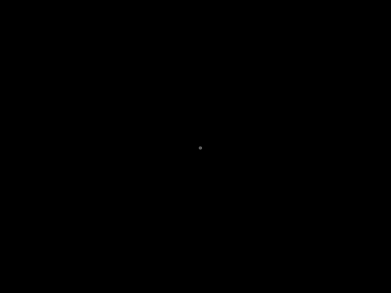

# HuygensPrinciple
There are two animations here. The first one, on the left, shows a more aesthetically pleasing image of Huygens Principle, while the one on the right shows a version of the animation that is a bit more technically accurate.

The animations show a single point source that emits a wave, the crest of which is shown as the white circle. After this first wave crest travels a bit, some points on it are then used as other point sources for new wave crests. As the waves travel outward, it becomes clear that the wavefront is still a circular wave centered at the original center. One could imagine that as more points on the original wavefront are treated as point sources, the approximation would be better. This is especially apparent on the right animation because the original wavefront continues expanding and eventually become indistinguishable from the secondary waves.

 

The creation of these animations was significantly simplified with the use of mplanimations, as it only requires 53 lines of code for the left animation and 46 for the right animation. The drawback, however, is that the code may be difficult to read.
