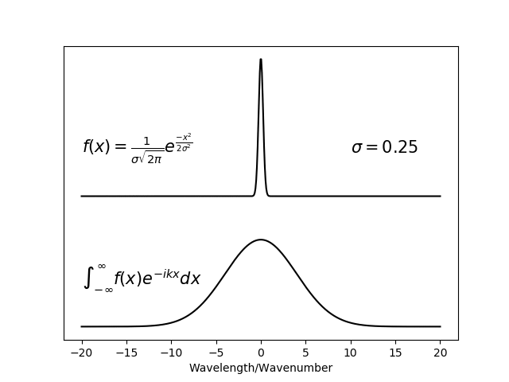

# mplanimations

This module was created for my own use, so it may not be easy for others to work with, and I do not claim it is optimized as best it can be. Nevertheless, I have created the documentation below both as a reference for myself and so that anyone interested can look through it because it has allowed me to drastically simplify some animations.

Below are two examples of animations I have made using this module paired with matplotlib. The code is available in the folders along with a brief explanation of what is being shown.

 

## REQUIREMENTS:

- matplotlib and NumPy must be installed.
- Interval in FuncAnimation must match interval used by mplanimations; default is 20, but it can be changed by changing "mplanimations.transitions.interval".
- An object oriented approach must be used. For example, the axes should be created as `fig, ax = plt.subplots()`.

## FUNCTIONS:

### Alpha Transition
Creates a smooth transition between two alpha values.

`alpha_transition(i, starttime, alpha1, alpha2, transitionline, transition_time=1, transition_type='sine')`
- `i`: the index required by the FuncAnimation method
- `starttime`: the time at which the transition should start, in seconds
- `alpha1`: the initial alpha value
- `alpha2`: the final alpha value
- `transitionline`: the line for which the data will be updated; must be created before use of this function
- `transition_time`: the amount of time the transition will take, in seconds; default value is 1 second
- `transition_type`: the type of transition that will be displayed; options are 'sine' and `linear`; default is `sine`

### Axis Transition
Creates a smooth transition for the axis limits.

`axis_transition(i, starttime, xlim1, xlim2, ylim1, ylim2, axis, transition_time=1, transition_type='sine')`
- `i`: the index required by the FuncAnimation method
- `starttime`: the time at which the transition should start, in seconds
- `xlim1`: a list that contains the starting x limits; e.g. `[-2, 2]`
- `xlim2`: a list that contains the ending x limits; e.g. `[-4, 4]`
- `ylim1`: a list that contains the starting y limits
- `ylim2`: a list that contains the ending y limits
- `axis`: the axis the transition should take place on; e.g. if `fig, ax = plt.subplots()` is used, axis should be `ax`
- `transition_time`: the amount of time the transition will take, in seconds; default value is 1 second
- `transition_type`: the type of transition that will be displayed; options are `sine` and `linear`; default is `sine`

### Color Transition
Creates a smooth transition between two colors.

`color_transition(i, starttime, cmap, c1, c2, transitionline, transition_time=1, transition_type='sine')`
- `i`: the index required by the FuncAnimation method
- `starttime`: the time at which the transition should start, in seconds
- `cmap`: the color map to be used; e.g. "plt.cm.jet" is a valid option
- `c1`: a float between 0 and 1 inclusive that indicates the starting color
- `c2`: a float between 0 and 1 inclusive that indicates the ending number
- `transitionline`: the line for which the data will be updated; must be created before use of this function; e.g. `tline = ax.plot(x, y)` gives the valid option `tline` for object
- `transition_time`: the amount of time the transition will take, in seconds; default value is 1 second
- `transition_type`: the type of transition that will be displayed; options are 'sine' and `linear`; default is `sine`

### Dot Transition
Creates a smooth transition for changing the dot size on a scatter plot.

`dot_transition(i, starttime, size1, size2, dot, transition_time=1, duration='inf')`
- `i`: the index required by the FuncAnimation method
- `starttime`: the time at which the addition should start, in seconds
- `size1`: the initial size of the dot
- `size2`: the final size of the dot
- `dot`: the scatter plot for which the dot size will be updated (e.g. `dot = ax.scatter(0, 0)`)
- `transition_time`: the amount of time the transition will take, in seconds; default value is 1 second
- `duration`: the amount of time, in seconds, the dot will be on the screen before the exit transition begins; default is `inf` for infinity, but any other must be integers or floats

### Line Transition
Creates a smooth transition between two functions of x.

`line_transition(i, starttime, yvals1, yvals2, transitionline, transition_time=1, transition_type='sine')`
- `i`: the index required by the FuncAnimation method
- `starttime`: the time at which the transition should start, in seconds
- `yvals1`: the y values of the initial function in a numpy array; in the form of some function performed on xvals (e.g. xvals**2)
- `yvals2`: the y values of the final function in a numpy array; in the form of some function performed on xvals (e.g. `xvals**3`)
- `transitionline`: the line for which the data will be updated; must be created before use of this function
- `transition_time`: the amount of time the transition will take, in seconds; default value is 1 second
- `transition_type`: the type of transition that will be displayed; options are `sine` and `linear`; default is `sine`

### Parametric Transition
Creates a smooth transition between two sets of parametric equations.

`par_transition(i, starttime, xvals1, xvals2, yvals1, yvals2, transitionline, transition_time=1, transition_type='sine')`
- `i`: the index required by the FuncAnimation method
- `starttime`: the time at which the transition should start, in seconds
- `xvals1`: the numpy array that contains the initial x values; must be linearly spaced for sinusoidal transition
- `xvals2`: the numpy array that contains the final x values; must be linearly spaced for sinusoidal transition
- `yvals1`: the y values of the initial function in a numpy array; in the form of some function performed on xvals (e.g. `xvals**2`)
- `yvals2`: the y values of the final function in a numpy array; in the form of some function performed on xvals (e.g. `xvals**3`)
- `transitionline`: the line for which the data will be updated; must be created before use of this function
- `transition_time`: the amount of time the transition will take, in seconds; default values is 1 second
- `transition_type`: the type of transition that will be displayed; options are `sine` and `linear`; default is `sine`

### Variable Transition
Creates a variable that smoothy transitions between two values.

`var_transition(i, starttime, initial, final, transitionline, func, transition_time, transition_type='sine')`
- `i`: the index required by the FuncAnimation method
- `starttime`: the time at which the transition should start, in seconds
- `initial`: the initial value of the variable that will be changing
- `final`: the final value of the variable that will be changing
- `transitionline`: the line for which the value of the variable will be changed; must be created before use of this function; e.g. `tline = ax.plot(x, y)` gives the valid option `tline` for object
- `func`: the function that the variable will be plugged into
- `transition_time`: the amount of time the transition will take, in seconds; default values is 1 second
- `transition_type`: the type of transition that will be displayed; options are `sine` and `linear`; default is `sine`

## NOTES:

- For the transitions to function as intended, the values for the lines must be evenly spaced. Using NumPy's `linspace(a, b, c)` method is recommended. New transitions types can be created by not using linear spacing with some cleverness.
- The number of intermediate lines for a transition is set as interval/1000, so a small interval will lead to not only less FPS, but also less intermediate lines.
- The interval set in mplanimation must be the same as the interval set for FuncAnimation for the timing to work correctly; default interval is 20
- Lines defined using the matplotlib plot() function that are going to be changed with the module must have a comma after them (e.g. `line1, = ax.plot(x, y)`).
- The interval can be changed with `mplanimations.transition.interval = number`, where number is the interval you want to set.
- All transition instances must be instantiated in advance; they can not be instantiated in the FuncAnimation animation function. This can be done by, for example, typing `t1 = mplanimations.transitions()` outside of the animation function, and then using this instance in the animation function.
- All transitions act on lines, dots, etc. already created outside of the animation function; they do not create the lines, dots, etc.; this means that the lines, dots etc. must be created outside of the animation function, and then they will be changed by the mplanimations methods.
- `dot_transition()` does not function correctly when the duration is less than or equal to `transition_time`.

## HOW IT WORKS:

The transitions use a kind of weighted average to create the intermediate lines.
For the sinusoidal transition, the "weight" is "shifted" unevenly so as to create more intermediate lines closer to the beginning and final lines. The formula used to do this is:
[L1[n-n(.5sin((pi/n)t-pi/2)+.5)]+L2[n(.5sin((pi/n)t-pi/2)+.5)]]/n
where L1 is the NumPy array for the initial line, L2 is the NumPy array for the final line, n is a fixed number determined by the interval, and t is a number that counts up, usually from 0.
For the linear transition, the weight is even and the intermediate lines are created through a simple weighted average using the formula:
[L1(n-t)+L2(t)]
where the variables are the same as those for the sinusoidal transition.

## USEFUL TIPS:

- Transitions can be instantiated in a list using the `for i in range()` command. They can then be accessed for the transitions.
- Plots can be created in a list, but they must be followed by `[0]`. For example, `for i in range(10):` can be used for iteration, and then `lines.append(ax.plot(x, y)[0])` to create the list "lines" with 10 lines created.
