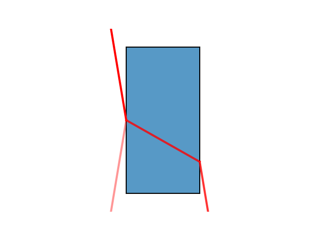

An animation of Snell's Law that was made using the `var_transition` function of mplanimations. A source of light passes through a material with a refractive index of 2 and the resulting refraction can be seen. The light then leaves the material and continues on parallel to but displaced from the original beam.

