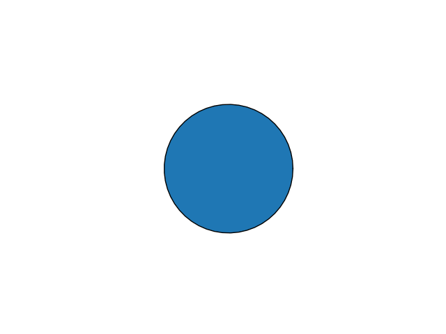

An animation that shows the path of light rays through a spherical object with a refractive index of 1.5. This shows the `tail` effect of mplanimations being used to create the fading tails behind the light beams.

